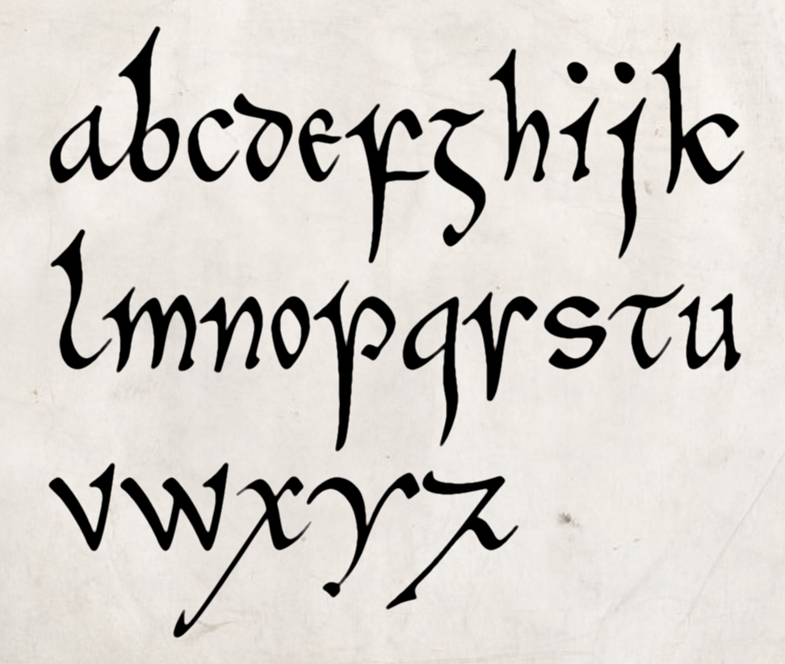

# Cerne-font

No, it has nothing to do with the big phallic giant, but everything to do with the [Book of Cerne](https://en.wikipedia.org/wiki/Book_of_Cerne),
a ninth-century prayerbook the main script of which is an elegant pointed insular minuscule. Like my other script fonts (e.g. Eadui and Cissanthemos),
it will default to a modern mode more-or-less comprehensible to modern readers, but it can easily be switched to historical mode, in which it will
accurately reproduce the look of the early medieval script. The images below illustrates modern mode.

The font is not yet read to use (no caps! little punctuation!). ETA for an initial release: Late summer 2021.
