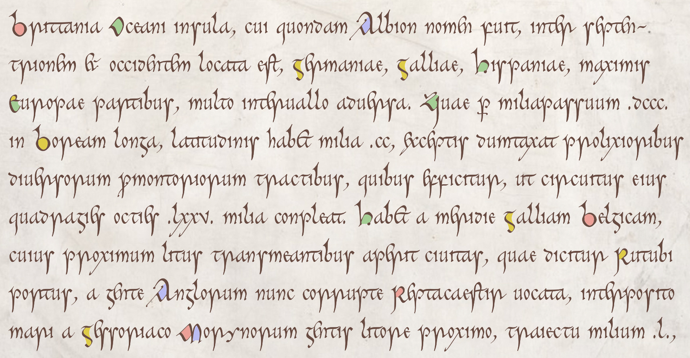

# The Cerne font

No, it has nothing to do with the
[phallic giant](https://en.wikipedia.org/wiki/Cerne_Abbas_Giant),
but everything to do with the
[Book of Cerne](https://en.wikipedia.org/wiki/Book_of_Cerne),
a ninth-century prayerbook, the main script of which is a beautiful pointed insular minuscule,
cursive in appearance (though it is in fact not heavily ligatured) and yet formal.
Like my other script fonts (e.g.
[Eadui](https://github.com/psb1558/Eadui-Font) and
[Cissanthemos](https://github.com/psb1558/Cissanthemos-font)),
it will default to a modern mode more-or-less comprehensible to modern readers, but it can easily be switched to historical mode, in which it will
closely approximate the look of the early medieval script.
Unlike my other scripts, this is a color font, with color highlights for capitals (and, optionally,
for lowercase letters, accents and punctuation),
and a text color based on the colors found in the manuscript.

Check out the [specimen page](https://psb1558.github.io/Cerne-font/), where you
can enter a text of your choice, switch back and forth between modern and
historical mode, and play with the colors.

The font will come in two versions: a compact webfont with a COLR table, usable
in all major browsers, and a desktop version with both COLR and SVG tables,
usable in LibreOffice, Microsoft Word, the Adobe Creative Suites, and most
other software supporting color fonts. The font will also work in apps that do
not support color, but the colors will not show.

The current version is a beta, version 0.004, neither complete nor guaranteed
to be stable. ETA for an initial release: late summer 2021.
