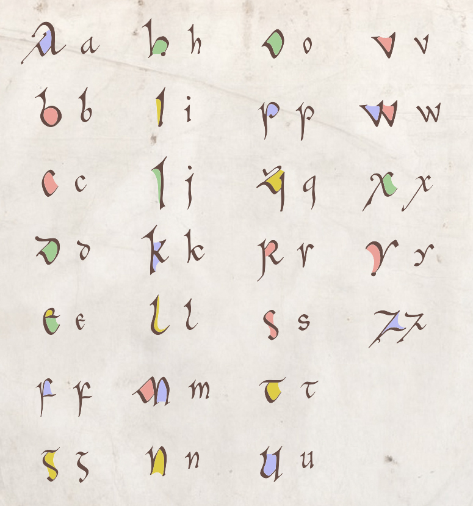
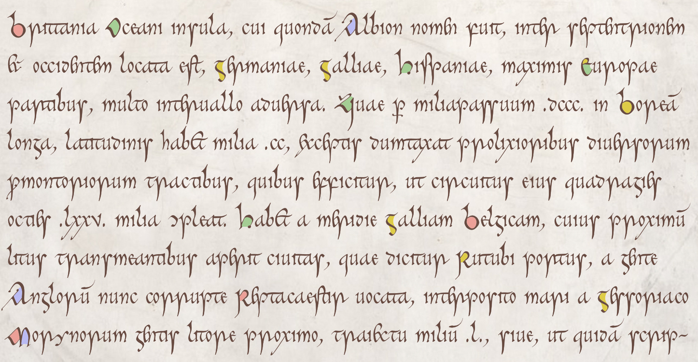

# The Cerne font

No, it has nothing to do with the big phallic giant, but everything to do with the [Book of Cerne](https://en.wikipedia.org/wiki/Book_of_Cerne),
a ninth-century prayerbook, the main script of which is a beautiful pointed insular minuscule,
cursive in appearance (though it is in fact not heavily ligatured) and informal.
Like my other script fonts (e.g.
[Eadui](https://github.com/psb1558/Eadui-Font) and
[Cissanthemos](https://github.com/psb1558/Cissanthemos-font)),
it will default to a modern mode more-or-less comprehensible to modern readers, but it can easily be switched to historical mode, in which it will
accurately reproduce the look of the early medieval script. Unlike my other scripts, this is a color font, with color highlights for capitals (and, eventually, a selection of other characters) and a text color based on the colors found in the manuscript. The image below illustrates modern mode.

And here is a prose sample (in historic mode), though there are still miles to go:

The font is not yet ready to use (many characters missing! horrible metrics!). ETA for an initial release: Late summer 2021.
