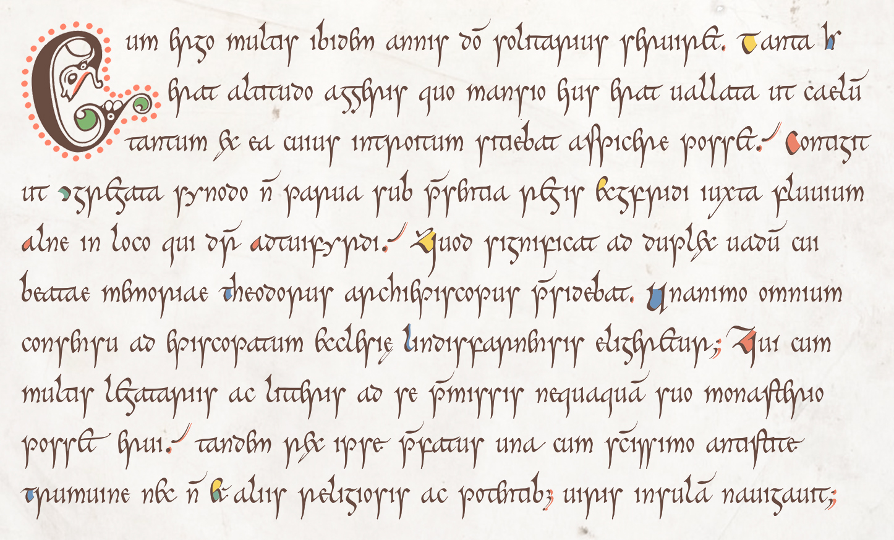

# The Cerne font

No, it has nothing to do with the infamous
[phallic giant](https://en.wikipedia.org/wiki/Cerne_Abbas_Giant),
but everything to do with the
[Book of Cerne](https://en.wikipedia.org/wiki/Book_of_Cerne),
a ninth-century prayerbook, the main script of which is a beautiful pointed insular minuscule,
cursive in appearance (though it is in fact not heavily ligatured) and yet formal.
Like my other script fonts (e.g.
[Eadui](https://github.com/psb1558/Eadui-Font) and
[Cissanthemos](https://github.com/psb1558/Cissanthemos-font)),
it will default to a modern mode more-or-less comprehensible to modern readers, but it can easily be switched to historical mode, in which it will
closely approximate the look of the early medieval script.
Unlike my other scripts, this is a color font, with text the color of the ink
used by the medieval scribe, color highlights for capitals, and, optionally,
highlights for many other characters. All of the font’s colors are based on
pigments likely to have been used in the original book.

Check out the [specimen page](https://psb1558.github.io/Cerne-font/), where you
can enter a text of your choice, switch back and forth between modern and
historical mode, and play with the colors. If you’re curious about how a font
like this works, read [How Cerne Emulates a Handwritten Script](https://psb1558.github.io/Cerne-font/howitworks.html).

The font will come in two versions: a compact webfont (woff2) with a COLR table, usable
in all major browsers, and a desktop version (otf) with both COLR and SVG tables,
usable in LibreOffice, Microsoft Word, the Adobe Creative Suite, and most
other software supporting color fonts. The font will also work in apps that do
not support color: they will treat it like an ordinary font.

There will also be a companion font containing selected decorative capitals
from the manuscript.

The current version is 1.000, the first stable version and the first release
of this font.
